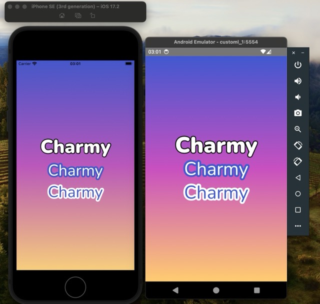
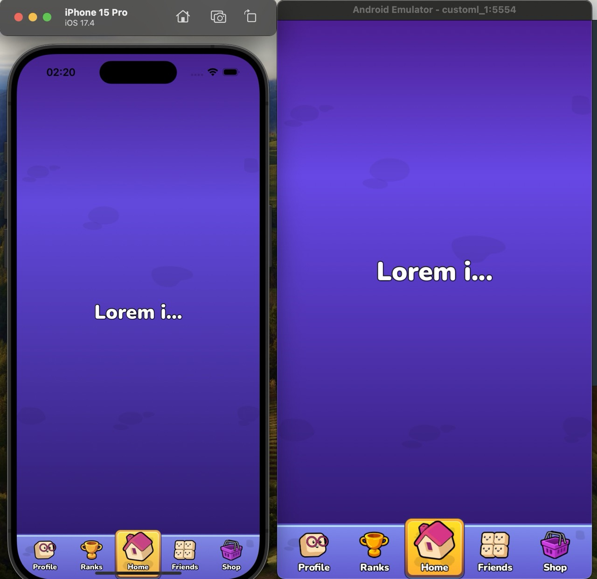

# React Native Stroke/Outline Text

[](https://badge.fury.io/js/@charmy.tech%2Freact-native-stroke-text)

Allows you to add stylish text with stroke effects to your mobile applications. It is perfect for creating visually
appealing text elements with outline effects.

<h1 align="center">
  
</h1>

## Installation

```bash
npm install @charmy.tech/react-native-stroke-text
# or
yarn add @charmy.tech/react-native-stroke-text
```

# android
min ```compileSdkVersion``` is required to be ```34```

Go to your ios folder and run:

```
pod install
```

## Usage

Here's a quick example to get you started with StrokeText:

```jsx
import React from "react";
import { StrokeText } from "@charmy.tech/react-native-stroke-text";
import { View } from "react-native";

export default function Screen() {
  return (
    <View style={{ flex: 1, justifyContent: "center", alignItems: "center" }}>
      <StrokeText
        text="Test"
        fontSize={50}
        color="#000000"
        strokeColor="#c334eb"
        strokeWidth={20}
        fontFamily="Nunito-Black"
      />
    </View>
  );
}

```

### Props

The following table outlines the props available for the `StrokeText` component:

| Prop            | Type    | Description                                                     |
|-----------------|---------|-----------------------------------------------------------------|
| `text`          | string  | The text content you want to display.                           |
| `fontSize`      | number  | Size of the text font, defining how large the text will be.     |
| `color`         | string  | Color of the text, can use any valid color format.              |
| `strokeColor`   | string  | Color of the stroke (outline) around the text.                  |
| `strokeWidth`   | number  | Width of the stroke, determining the thickness of the outline.  |
| `fontFamily`    | string  | Font family for the text, should match available project fonts. |
| `align`         | string  | Text alignment (default: `center`)                              |
| `numberOfLines` | number  | Number of lines (default: `0`)                                  |
| `ellipsis`      | boolean | Ellipsis (...) (default: `false`)                               |
| `width`         | number  | Text width to enable ellipsis (default: `undefined`)            |

## Ellipsis

```jsx
<StrokeText
  text="Lorem ipsum"
    width={150} // +
    ellipsis={true} // +
    numberOfLines={1} // +
  fontSize={32}
  color="#FFFFFF"
  strokeColor="#000000"
  strokeWidth={2}
  fontFamily="Nunito-Black"
  align="center"
/>

```

<h1 align="center">
  
</h1>

## Custom Font

### Bare React Native

Create a `react-native.config.js` file in the root directory

```javascript
module.exports = {
  project: {
    ios: {},
    android: {},
  },
  assets: ['/assets/fonts'], // or './src/assets/fonts'
};
```

### Expo ([expo-font](https://docs.expo.dev/versions/latest/sdk/font/))

```tsx
import { useFonts } from "expo-font";
import { Dosis_400Regular } from "@expo-google-fonts/dosis";


const [fontsLoaded, fontError] = useFonts({
  Danfo: require("./src/assets/fonts/Danfo-Regular.ttf"),
  "Dosis-Regular": Dosis_400Regular,
});
```

## Contributing

We welcome contributions to improve this component. Feel free to submit issues and enhancement requests.

## License

Please refer to the project's license for usage rights and limitations.
